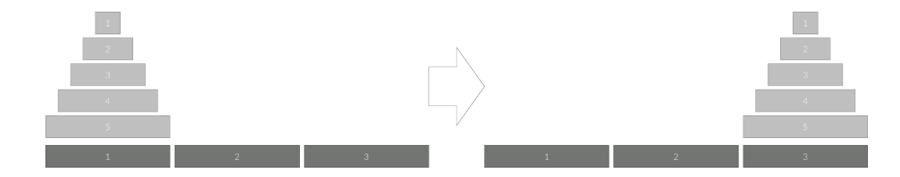

11729번

**하노이 탑 이동 순서**

**문제**

세 개의 장대가 있고 첫 번째 장대에는 반경이 서로 다른 n개의 원판이 쌓여 있다. 각 원판은 반경이 큰 순서대로 쌓여있다. 이제 수도승들이 다음 규칙에 따라 첫 번째 장대에서 세 번째 장대로 옮기려 한다.

한 번에 한 개의 원판만을 다른 탑으로 옮길 수 있다.
쌓아 놓은 원판은 항상 위의 것이 아래의 것보다 작아야 한다.
이 작업을 수행하는데 필요한 이동 순서를 출력하는 프로그램을 작성하라. 단, 이동 횟수는 최소가 되어야 한다.

아래 그림은 원판이 5개인 경우의 예시이다.




**입력**

첫째 줄에 첫 번째 장대에 쌓인 원판의 개수 N (1 ≤ N ≤ 20)이 주어진다.


**출력**

첫째 줄에 옮긴 횟수 K를 출력한다.

두 번째 줄부터 수행 과정을 출력한다. 두 번째 줄부터 K개의 줄에 걸쳐 두 정수 A B를 빈칸을 사이에 두고 출력하는데, 이는 A번째 탑의 가장 위에 있는 원판을 B번째 탑의 가장 위로 옮긴다는 뜻이다.


예제 입력 1

3

예제 출력 1

7
1 3
1 2
3 2
1 3
2 1
2 3
1 3


4-

1 3
1 2
3 2
1 3
1 2
3 2


<https://www.acmicpc.net/problem/11729>

```Python

n = int(input())

print(2**n-1)

def hanoi(n, fr, by, to): # n개의 원반을 from 에서 by를 거쳐 to로 옮긴다.

    if n == 1:
        print(fr, to)
    else :
        hanoi(n-1, fr, to, by) # 1번  N-1개의 원반을 기둥3을 거쳐 2로 옮긴다.
        print(fr, to) # 2번 기둥 1에서 1개의 원반을 기둥 3으롱 롬긴다.
        hanoi(n-1, by, fr, to) # 3번 기둥 2에서 N-1개의 원반을 기둥 3으로 옮긴다
hanoi(n, 1, 2, 3)

```
